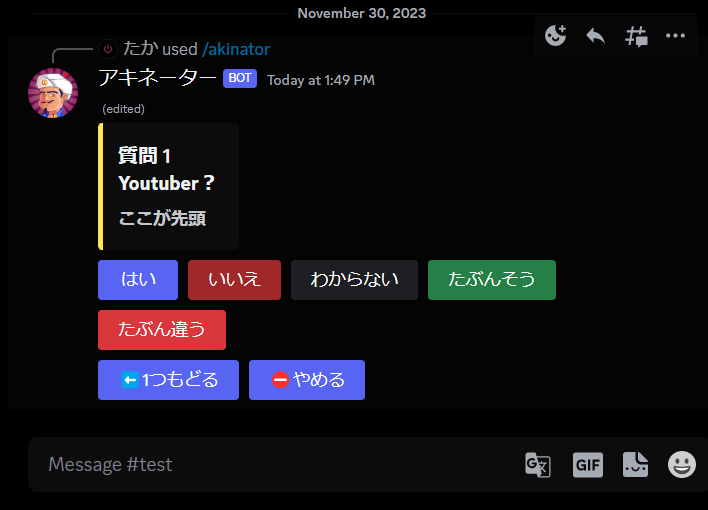
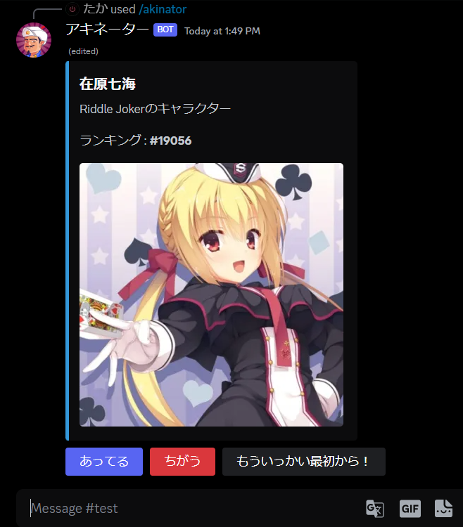
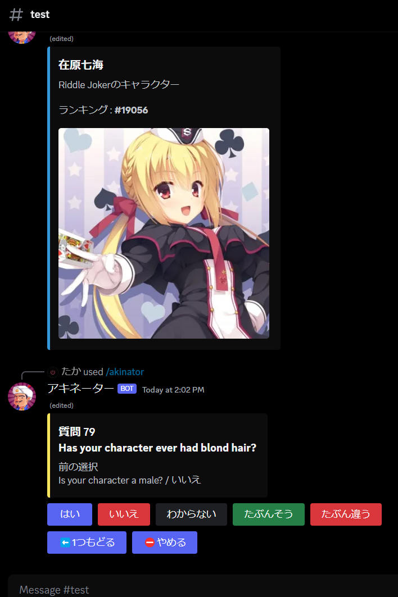

# Discord-Akinator-Bot
Akinator.pyをDiscord向けに改造したBotです。ボタンタイプで操作しやすいと思います。
##### すでに作ってあるので招待はここから
https://discord.com/api/oauth2/authorize?client_id=1179457976327737365&permissions=8&scope=bot  
## Botの説明
  
/akinatorでゲームを開始します  
操作はふつうのアキネーターとおなじです  
  
アキネーターがキャラクターを推測するとこのように画像とテキストで埋め込みが送信されます  
  
どうやら日本語サーバーと英語サーバーはデータベースが違うようで日本語サーバーだとでるキャラクターは英語サーバーだとでない/でにくい場合があります  
埋め込みされる画像もサーバーによって違うようです  
## Botのセットアップ
下記モジュールをインストールしておいてください
- discord.py
- akinator.py
    
15行目にあるBOTTOKENに自分のBotのトークンをペーストして実行するだけです  
もしDiscord Botの作り方を知らなかったら検索してみてください  
大量にでてきます  

##### 作者とのコンタクト  
ユーザーネーム -> .taka.  
or  
https://discord.gg/aSyaAK7Ktm  
